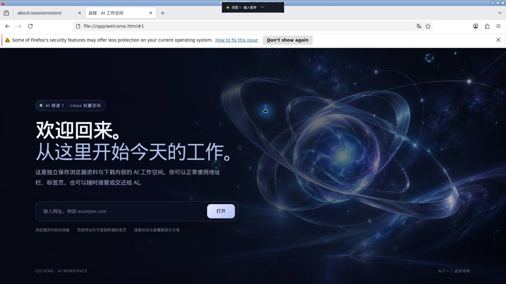

# 启程 · AI 工作区

给 AI 独立的工作区，随时查看、接管，或回到自己的电脑。

启程提供两种 Windows 主机安装包：默认使用轻量版；需要 Windows 原生应用时选择兼容版。AI 模型由你已有的客户端提供，安装包不包含模型订阅或 API 密钥。

| 下载类别 | 适合的任务 | 需要的环境 |
|---|---|---|
| **Qicheng-Lite.zip · 轻量版** | 浏览器、网页后台、独立浏览器资料与下载文件 | Windows 主机、可用的 Docker Linux engine；首次构建需要联网 |
| **Qicheng-Windows-Channels.zip · Windows 兼容版** | 必须在 Windows 客体里运行的原生工具 | 支持 Hyper-V 的 Windows、Python 3.12+、独立准备并获授权的 Windows 客体 |

发布资产见 [Releases](https://github.com/Duan-zx/qicheng-agent-channels/releases)。尚未发布的构建不在此承诺为可下载版本。

## 轻量版使用

1. 解压轻量安装包，运行包内安装入口；已有 Docker Linux engine 才能启动工作区。
2. 安装后后台驻留。按 **Alt+2 / Alt+3** 进入两个工作区，**Alt+1** 回本机。
3. 选择“我来接管”后使用浏览器；选择“交给 AI”后，已连接的 AI 客户端才可以输入。
4. 浏览器资料与 Downloads 分别保存在两个独立 Docker 数据卷中，更新程序不删除它们。

安装包内的快速说明提供诊断、AI 接入与数据位置。Windows 兼容版有独立入口，同一时刻只启用一个版本的全局快捷键，避免冲突。

## 开源范围

本仓只包含产品源码、安装构建脚本、公开说明及脱敏验证记录；不包含内部协作库、用户浏览器资料、访问 token、Windows 镜像或第三方商业软件。

启程自有代码使用 Apache-2.0。第三方运行时与容器内软件保留各自许可证，见轻量包内 THIRD-PARTY-NOTICES.md；不能将所有依赖重标为 Apache-2.0。Docker Desktop 不是本产品捆绑的软件，其使用条款需要单独遵循。

实际验证范围与限制见 [验证记录](docs/VALIDATION.md)。本项目目前为 Alpha，不将自动测试通过等同于所有网站、登录流程或 Windows 软件均兼容。
