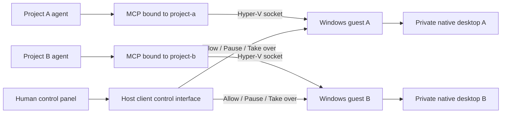

# Windows channel architecture (experimental)

Each project binds to one Hyper-V VM ID, one BIOS UUID and one independently generated token. A stdio MCP process loads one project binding at startup. The host uses Hyper-V sockets to reach that VM; it never uses host mouse, keyboard or clipboard APIs.

The panel and MCP use the same host client library through separate entry points. Control operations are deliberately absent from the agent's MCP tool list. Native human interaction takes place in VMConnect after pausing or taking over the relevant channel.

## Identity and transport

Before constructing desktop-control objects or opening a listener, the guest verifies that it is running on Windows, that WMI identifies a Microsoft virtual machine and that the BIOS UUID matches the deployment binding. Its listener binds to the Hyper-V parent partition only. Each request is authenticated with the guest's token. Before sending an operation, the host obtains state and checks the returned BIOS identity and guest-only input target.

No IP address, TCP listener, exposed HTTP port or shared clipboard is required for this control path. Windows update and application installation may still use the VM's separately configured network connection. Installation media, Windows licenses and third-party application licenses are separate dependencies.

## Control state

The guest starts paused. A human explicitly allows agent control for a task. Human takeover rejects agent input; the host's allow command cannot overwrite takeover directly. Pause is always available. An input failure or unavailable interactive desktop pauses the channel. Session 0 and non-Default input desktops are rejected; the agent does not bypass lock screens or UAC.

State and screenshot are observations. The MCP exposes only state, screenshot and input; it cannot install software, run arbitrary commands or enable itself. Tools and page content inside the guest remain untrusted instructions. External actions still need the user's task authorization.

## Scope of isolation

Separate VMs isolate the two desktops and their native input paths. This does not sandbox an agent that already has unrestricted host filesystem or administrator access. Host configuration and tokens must be protected as local credentials. Do not publish `.local`, VM disks, account profiles or installation media.

## Evidence still required

Unit and protocol tests use simulated desktop/transport implementations. A usable release additionally needs real guest identity mapping, Hyper-V socket connection, screenshots, Unicode input, pause/takeover, both native applications, concurrent operation, disconnect/reconnect and locked-desktop behavior. Source compilation and a VM's running state alone do not establish these outcomes.
